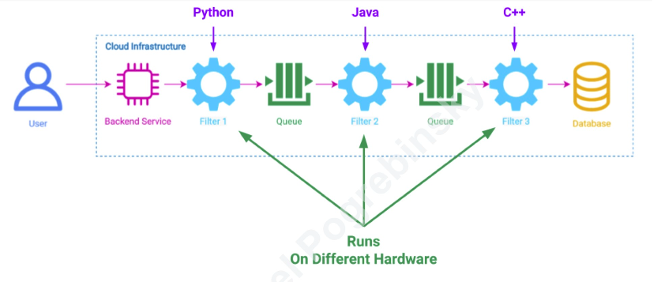
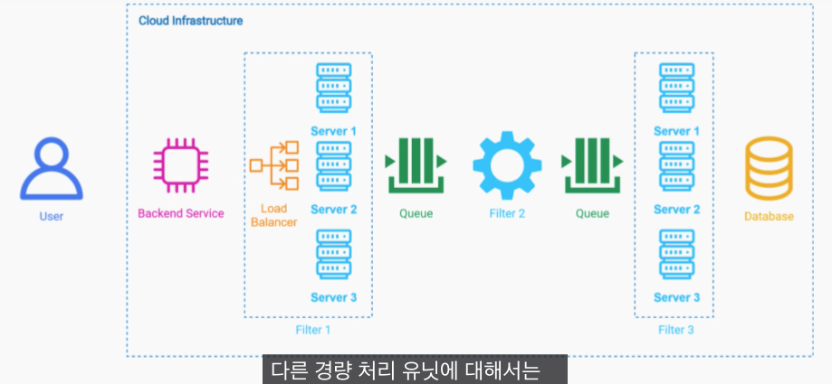
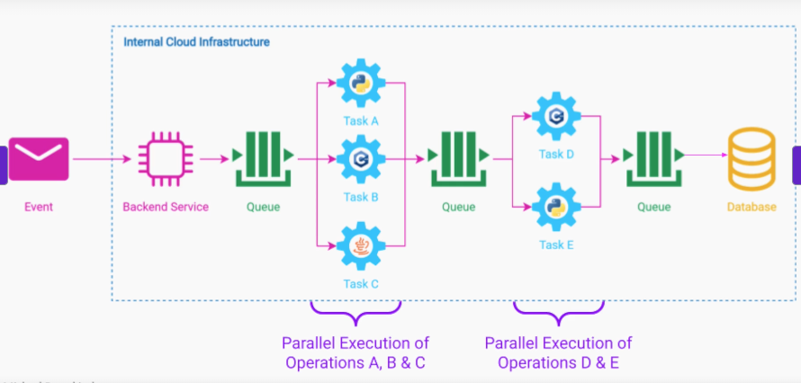
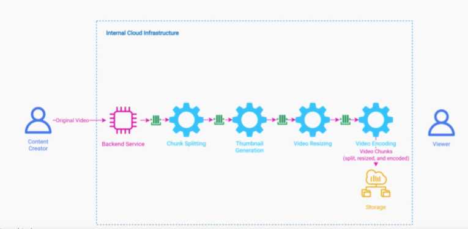

# 개요

파이프라인을 통해 데이터를 필터링하는 패턴을 의미한다.
여기서 Data Source는 들어온 데이터를 의미하며, Data Sink는 최종 데이터 목적지를 의미한다.

# 특징
## 모놀로식 접근
만약 하나의 애플리케이션에서 머신 러닝, 비즈니스 로직, CPU 집중 작업을 순차적으로 처리할 해야할 경우, 모놀로식 구성은 매우 어렵다. 이를 강한 경합성이라고 말한다.
또한, 1번 작업은 GPU, 2번 작업은 좋은 CPU, 3번 작업은 많은 메모리가 필요한 경우 이를 모두 만족하는 하드웨어로 인스턴스를 구성하는 것에는 한계가 있다.
당연하게도 이런 구성 방식은 확장성 면에서도 상당히 떨어진다.

## 분산 접근

각각의 필터는 별개의 컴포넌트로 분리하고, 큐를 이용하여 필터 사이에 요청을 제어하도록 구현하면 훨씬 성능과 비용을 높일 수 있다.
또한, 만약 1번 작업에 병목이 생기면, 해당 필터만 스케일 아웃을 적용하면 되기에 확장성 면에서도 이득이다.

마지막으로 병렬처리 또한 가능하다. 테스크를 여러개로 나눠서 한번에 처리하도록 구현하기도 간편하다.

# Use Case
## 비디오 스트리밍

비디오 스트리밍의 경우, 전체 파일을 통으로 보내지 않고 청크 단위로 보내서 동영상이 끊기지 않고 재생되도록 구현한다.
또한, 이렇게 각 청크의 썸네일을 2번 필터가 수행.
3번 필터에선 사용자의 네트워크 상태에 의해 청크별 화질로 나눈다.
마지막으로 비디오 인코딩을 위해 비디오 청크를 storage에 저장한다.

# 주의사항
파이프필터를 유지하려면 세분화된 필터로 힌해 오버헤드가 발생할 수 있다. 따라서, 적절한 분리를 통해 오버헤드를 조절해야 한다.
또한, stateless가 필요하다.
트랜잭션을 요구하는 작업에는 적절치 않다. 각 필터가 분산되어 있기 때문에 트랜잭션 설정하기가 매우 어렵다.