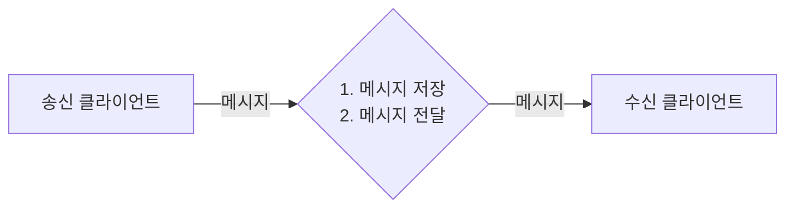
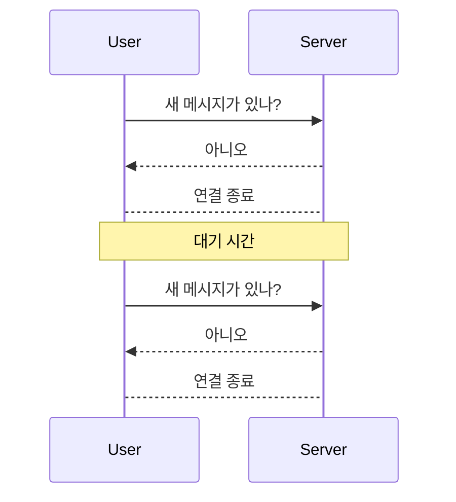
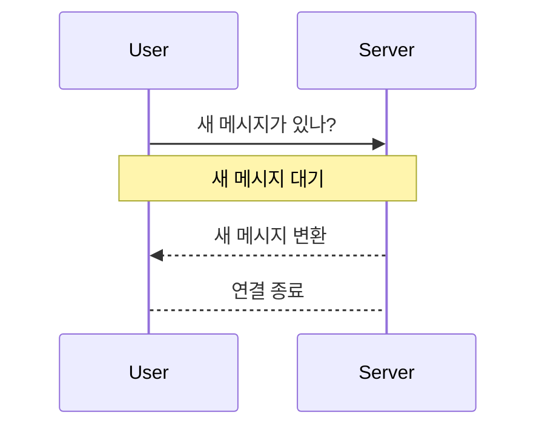
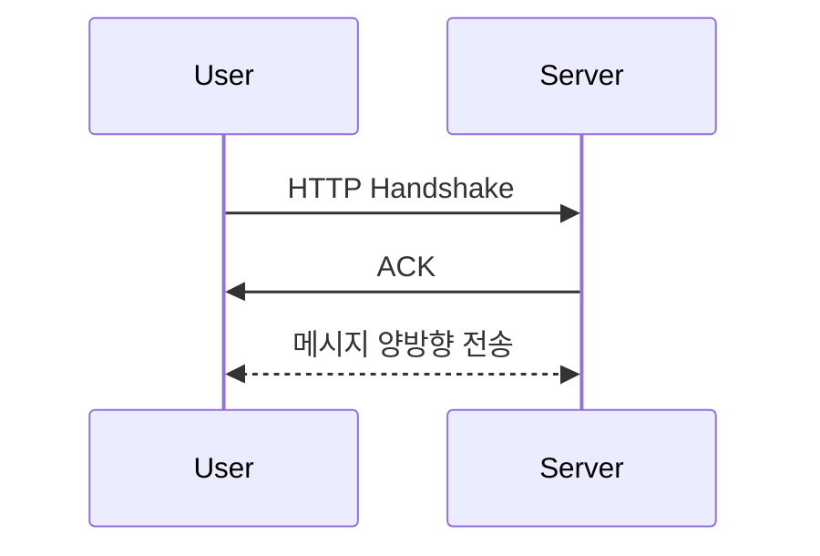
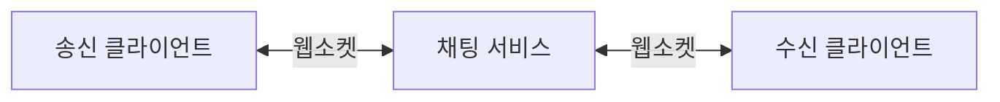

# 1. 문제 이해 및 설계 범위 확정
- 응답지연이 낮은 일대일 채팅 기능
- 최대 100명까지 참여할 수 잇는 그룹 채팅 기능
- 사용자의 접속상태 표시 기능
- 다양한 단말 지원. 하나의 계정으로 여러 단말에 동시 접속 지원
- 푸시 알림

# 2. 개략적 설계안 제시 및 동의 구하기

## 기술 비교
### Polling
폴링은 클라이언트가 주기적으로 서버에게 새 메시지가 있는지 물어봄.
답해줄 메시지가 없는 경우에도 서버 자원이 불필요하게 낭비됨.

### Long Polling
클라이언트는 새 메시지가 반환되거나 타임아웃 될 때까지 연결을 유지.
클라이언트는 새 메시지 받으면 기존 연결 종료, 서버에 새로운 요청을 보내 다시 시작.

**[ 단점 ]**
- 송신 클라이언트와 수신 클라이언트가 같은 서버에 없을 수도 있다.
- 서버 입장에서 클라이언트가 연결 해제했는지 알 방법이 없다.
- 메시지 별로 안받는 클라이언트도 타임아웃이 일어날 때마다 재연결하는 비효율 발생.

### WebSocket
서버가 클라이언트에게 async 메시지를 보낼 때 사용.

한번 맺어진 연결은 항구적이며 양방향.
핸드셰이크만 HTTP로 하고, 나머지는 웹소켓 프로토콜 이용.
HTTP는 양방향 소통이 어렵기 때문에 별도의 웹소켓 프로토콜 이용.

## 개략적 설계안
웹소켓을 사용하기로 결정했지만, 대부분의 기능(회원가입, 로그인, 사용자 프로파일 등)은 HTTP상에서 구현해도 됨.

### 무상태 서비스
