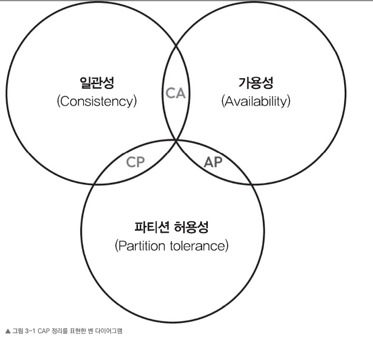
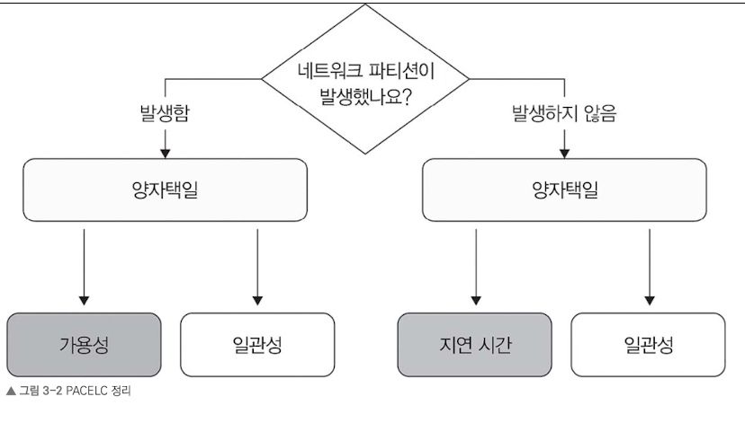
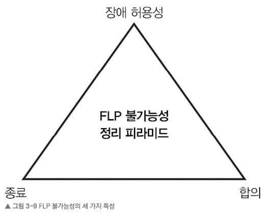

# 3.1 CAP 정리
분산 시스템이 일관성, 가용성, 파티션 허용성을 동시에 취할 ㅜㅅ 없다는 의미.

- 가용성 & 파티션 허용성 (AP)
  - 시스템을 계속 운영할 수 있지만, 모든 노드가 동시에 데이터를 동일하게 유지하기 어려움
- 일관성 & 파티션 허용성 (CP)
  - 모든 노드가 항상 같은 데이터를 가지지만, 파티션 상태에서는 일부 노드가 요청 처리를 못할 수 있음

파티션이 발생하지 않는 것이 이상적이지만, 하드웨어 고장, 네트워크 이상, 라우팅 문제 등으로 파티션은 무조건 발생하므로, 파티션 허용성을 처리하도록 설계해야 함.

CAP 정리가 모든 상황에서 속성 전부를 포기해야 한다는 의미가 아니다. 즉, 시스템 설계 시 일관성과 가용성 중 어떤 것을 우선시할지를 선택해야 한다.

# 3.2 PACELC 정리
- 파티션 허용성 (P)
  - 서로 다른 노드 간 네트워크가 끊겨도 지속적으로 작동해야 함
- 가용성 (A)
  - 강한 일관성을 포기하더라도 신속한 응답을 반환하는 것에 초점
- 일관성 (C)
  - 강한 일관성
- 그 외 (E)
  - 네트워크 파티션이 발생하지 않는 상황을 의미. -> 지연 시간과 일관성 중 하나를 선택해야 함
- 지연 시간 (L)
  - 경우에 따라 지연 시간이 짧아지도록 설계하면 일관성이 떨어지고 가용성이 줄 수 잇음
- 일관성 수준 (C)
  - 요구 사항이나 아키텍트가 세운 설계 방향에 따라 달라질 수 잇음

- 네트워크 파티션뿐 아니라 지연 시가노가 일관성에 미치는 영향도 함께 고민해야 함
- 이를 위해 여러 노드 간 합의를 이루는 것이 필수적
  - 팩소스 알고리즘과 래프트 알고리즘을 주로 사용

## 3.2.1 팩소스 알고리즘
시스템 내 모든 노드가 동의해야 하는 특정 데이터나 결정을 믜미.

### 핵심 포인트
  - 제안자: 합의해야 할 값을 제안하고, 이 제안을 다른 노드에 전파
  - 수용자: 제안자에게 제안을 받고, 제안이 수용되었는지 다른 노드에 알림
  - 학습자: 합의된 값을 최종적으로 받아 후속 작업 수행

### 과정

**1단계: 준비 및 약속 🤝**
제안자가 투표를 시작하기 위해 준비하는 과정입니다.
  - Prepare(n): 제안자는 중복되지 않는 고유한 번호(n)를 생성하여 수락자들에게 보냅니다.
  - Promise: 수락자는 자신이 지금까지 받은 번호 중 n이 가장 크다면, "앞으로 n보다 작은 번호의 제안은 받지 않겠다"고 약속하며 응답합니다. 만약 이전에 수락했던 값이 있다면 그 값도 함께 알려줍니다.

**2단계: 수락 요청 및 수락 ✅**
실제로 값을 제안하고 확정하는 과정입니다.
  - Accept Request(n, value): 제안자가 과반수 이상의 수락자로부터 약속을 받으면, 제안 번호 n과 함께 값을 보냅니다. (이때 값은 1단계에서 수락자들이 알려준 값 중 번호가 가장 큰 것을 사용하거나, 없으면 자신의 값을 사용합니다.)
  - Accepted: 수락자는 여전히 n보다 큰 번호에 대해 약속한 적이 없다면, 해당 제안을 최종적으로 수락합니다.

### 고려 사항
- 장애 허용성
  - 일부 노드가 작동하지 않거나 네트워크 분리된 상황을 처리 가능
- 확장성
  - 시스템에 포함된 노드 개수에 영향을 받음
- 복잡성
  - 모든 참여자가 프로토콜을 정확히 따르도록 설계해야 함

### 사용 사례
- 분산 데이터베이스
  - 각 복제 DB 사이의 일관성과 내구성 확보에 사용
- 분산 파일 시스템
  - 구글 파일 시스템이나 하둡 분산 시스템 등 분산 파일 시스템에서 여러 노드 간 메타데이터의 일관성과 가용성 유지
- 상태 기계 복제
  - 노드 클러스터가 작업 순서를 합의하여 레플리카 간 일관성을 유지함으로써 분산 키-값 저장소와 합의 기반 알고리즘 같은 시스템에서 장애 허용성과 복제를 가능하게 함

## 3.2.2 래프트 알고리즘
팩소스 알고리즘의 대안으로, 분산 시스템에 장애가 발생해도 하나의 일관된 상태에 합의할 수 있도록 하는 것이 목표

### 핵심 포인트
- 리더: 합의 과정 관리, 로그 항목을 다른 노드에 복제하도록 지시
- 추종자: 리더의 로그를 복제하고 들어오는 요청에 응답하는 수동적인 역할
- 후보자: 리더가 실패하거나 새로운 리더 선출 시 후보 상태로 바뀜

### 프토포콜 과정

- 리더 선출
  - 시스템 시작 또는 리더가 없는 경우, 새로운 리더 선출. 요청 투표 메시지를 보내서 과반수 투표를 받으면 리더 됨
- 로그 복제
  - 리더는 클라이언트 요청을 받아 로그에 추가, 해당 로그 항목을 추종자에게 복제
- 안정성과 일관성
  - 로그 추가, 투표 규칙처럼 특정 규칙을 적용하여 안정성과 일관성 유지

### 고려 사항
- 리더 가용성
- 확장성: 노드가 많아지면 오버헤드 심해짐
- 장애 허용성: 리더 장애 시 이를 감지해서 새 리더 선출하도록 확보해야 함

### 사용 사례
- 분산 데이터베이스 (아마존 DynamoDB)
- 분산 파일 시스템(구글 파일 시스템)
- 클러스터 관리 및 서비스 디스커버리 (아파치 주키퍼)
- 합의 기반 알고리즘(구글 스패너)
- 클라우드 인프라 관시 시스템(넷플릭스 카오스 자동 플랫폼)

# 3.3 비잔티움 장군 문제

**🏰 문제의 상황**

- 목표: 여러 명의 장군이 성 하나를 포위하고 있습니다. 이들이 승리하려면 **'공격'**할지 **'후퇴'**할지 모두가 똑같은 결정을 내려야 합니다.
- 전제 조건: 장군들은 서로 멀리 떨어져 있어 전령을 통해서만 소통할 수 있습니다.
- 장애물: 장군 중에는 배신자가 섞여 있을 수 있습니다. 배신자는 거짓 정보를 보내서 장군들이 서로 다른 결정을 내리게(분열하게) 만듭니다.

**🍎 왜 이 문제가 중요한가요?**
현대의 컴퓨터 시스템에서도 이와 똑같은 일이 일어납니다.

- 장군 = 네트워크상의 서버(노드) 💻
- 배신자 = 고장 난 서버나 해킹당한 노드 👾
- 합의 = 시스템이 정상적으로 돌아가기 위해 데이터를 일치시키는 과정

만약 일부 서버가 잘못된 데이터를 보내더라도 전체 시스템이 마비되지 않고 올바른 결정을 내릴 수 있다면, 그 시스템을 **'비잔티움 장애 허용(BFT)'**을 갖췄다고 부릅니다.

**해결 방안**
- 투표 알고리즘: 실행 계획에 대해 특정 기준 충족 시 실행되도록 합의점 도출
- 반복 서명 방식: 계획을 제안하고 서명으로 찬성 표시. 서명 안한 경우 배신자로 간주.
- 쿼럼 방식:
  - 쿼럼은 분산 시스템에서 합의를 위한 최소한의 동의 인원
  - 여러 쿼럼으로 장군을 나누고, 각 쿼럼에는 정상 장군이 과반수 이상 포함
  - 각 쿼럼 독립적으로 계획에 대해 투표 진행 -> 모든 쿼럼에서 과반수 찬성이면 최종 선택

## 3.3.1 비잔티움 장애
시스템 내 일부 노드가 예측할 수 없고 신뢰할 수 없는 행동을 보이는 상황

# 3.4 FLP 불가능성 정리
분산 시스템에서 문제가 생길 때 모든 참여자가 의견을 맞추는 것이 근본적으로 어렵다는 내용

### 성립 조건

- 비동기성: 메시지 지연 시간이나 프로세스 속도 제한이 없으며, 프로세스는 동신하지만 서로 같은 시간 값을 갖지 않음
- 프로세스 장애: 전체 프로세스 수가 n일 때 프로세스가 최대 f개 고장 날 수 있음 (0 < f < n)
- 유한한 단계: 각 프로세스는 정해진 유한한 단계만 수행하고 메시지 크기도 제한되어 있음

# 3.5 일관된 해싱
분산 시스템에서 데이터를 여러 노드에 효율적으로 분배하면서 노드를 추가하거나 삭제할 때 데이터 위치를 다른 곳으로 옮겨야 하는 과정이 최소화되도록 하는 방식

데이터를 저장할 수 있는 노드나 버킷의 수가 고정되어 있음

시스템에 노드를 추가, 제거할 때 전체 데이터를 다시 매핑하지 않고 일부 데이터만 이동하도록하여 영향을 최소화하는 것이 목표

# 3.6 블룸 필터
- 메모리를 적게 사용하면서도 특정 요소가 집합에 속해 있는지 빠르게 확인
- 포함될 가능성이 있는지를 판단 -> 거짓 양성이 포함될 수 있음

1. 데이터베이스(DB) 성능 최적화 🚀
데이터베이스에서 특정 데이터를 찾으려면 디스크를 읽어야 하는데, 이는 컴퓨터 작업 중 아주 느린 편에 속합니다. 블룸 필터를 앞에 두면, 데이터가 없는 경우 디스크를 확인하지 않고 바로 "없음"을 반환할 수 있어 시스템 전체 속도가 획기적으로 빨라집니다.
    - 예시: 카산드라(Cassandra), 구글 빅테이블(Bigtable)

2. 웹 브라우저의 보안 필터링 🛡️
구글 크롬 같은 브라우저는 사용자가 접속하려는 사이트가 위험한 곳인지 확인해야 합니다. 수억 개의 위험한 URL 목록을 사용자의 컴퓨터에 다 저장할 수는 없죠. 이때 블룸 필터로 압축해서 저장해두고, 접속하려는 URL이 "위험할 가능성이 있는지" 먼저 확인합니다.

3. 중복 확인 및 캐시 효율화 💾
    - 중복 가입 방지: 새로운 아이디가 이미 존재하는지 확인할 때, 실제 DB를 뒤지기 전에 블룸 필터로 1차 확인을 합니다.
    - 캐시 필터링: 한 번도 요청되지 않은 데이터는 캐시에 저장할 필요가 없겠죠? 블룸 필터로 처음 들어온 요청인지 확인하여 캐시 효율을 높입니다.

# 3.7 카운트-민 스케치
블룸 필터가 "데이터가 있니?"라는 질문에 답한다면, 카운트 민 스케치는 **"데이터가 몇 번 나타났니?"**라는 질문에 답하기 위해 사용됩니다.

이 알고리즘도 공간을 아주 적게 쓰면서 대량의 데이터를 실시간으로 처리하기 위해 약간의 오차(실제보다 더 많이 나왔다고 답할 확률)를 허용하는 확률적 자료구조입니다.

### 작동 원리
카운트 민 스케치는 단순한 비트 배열 대신 **숫자를 저장할 수 있는 2차원 표**와 여러 개의 해시 함수를 사용합니다.
1. 데이터 추가 (Update):
    - 데이터가 들어오면 여러 개의 해시 함수(h_1, h_2, ..., h_k)에 각각 넣습니다.
    - 각 함수가 가리키는 표의 칸에 있는 숫자를 +1씩 올립니다.
2. 횟수 조회 (Query):
    - 조회하고 싶은 데이터를 다시 해시 함수들에 넣습니다.
    - 함수들inim이 가리키는 여러 칸의 숫자들을 확인한 후, 그중 **가장 작은 값(Mum)**을 선택합니다.

> **🤔 왜 가장 작은 값을 고를까요?**
> 해시 충돌 때문에 어떤 칸은 실제 횟수보다 더 높은 숫자가 기록되어 있을 수 있습니다. 하지만 여러 칸 중 가장 작은 값을 고르면, 충돌로 인해 부풀려진 오차를 최대한 줄여서 실제 값에 가장 가깝게 추측할 수 있기 때문입니다.

### 사용 사례
- 빈도 추정: 데이터 스트림에서 특정 요소의 빈도를 추정하여 텍스트에서 특정 단어가 등장한 횟수를 세거나 온라인 쇼핑몰에서 인기 품목을 파악하는 통계 작업에 사용합니다.
- 트래픽 분석: 네트워크 트래픽 분석에서 특정 프로토콜이나 네트워크 주소와 관련된 패킷이나 흐름의 수를 파악하는 데 활용합니다.
- 웹 분석: 웹 사이트 방문 횟수, 클릭 수, 사용자 상호 작용 빈도를 추적하여 웹 트래픽을 효율적으로 분석할 수 있습니다.
- 분산 시스템: 분산 시스템에서 여러 노드에 걸친 요청 빈도를 추적하고 주요 지표를 모니터링하는 데 사용합니다.
- 데이터 스트림 처리: 실시간 데이터 스트림에서 메모리에 전체 데이터를 저장할 수 없다면 근삿값으로 빈도 추정을 가능하게 합니다.

# 3.8 하이퍼로그로그
하이퍼로그로그(HyperLogLog, HLL)는 **'얼마나 많은 서로 다른 값(Unique Elements)이 있는가?'**를 계산할 때 사용하는 확률적 자료구조입니다. 전문 용어로는 카디널리티 추정(Cardinality Estimation) 알고리즘이라고 불러요.

데이터의 개수가 수조 개에 달할 때 이를 정확히 세려면 엄청난 메모리가 필요하지만, 하이퍼로그로그를 사용하면 아주 적은 메모리(보통 몇 KB)만으로도 오차율 1% 내외의 근삿값을 찾아낼 수 있습니다.
이 마법 같은 기술의 핵심 원리는 **'연속된 0의 개수'**를 관찰하는 것에 있습니다.

### 작동 원리
동전 던지기 비유동전 던지기를 예로 들어볼게요.
어떤 사람이 동전을 던져서 **"앞면이 연속으로 10번 나왔어!"**라고 말한다면, 우리는 그 사람이 대략 몇 번이나 동전을 던졌을지 추측할 수 있습니다.
앞면이 한 번 나올 확률은 1/2이므로, 연속 10번(1/2^{10})이 나오려면 대략 1,024번 정도는 던졌을 것이라고 짐작하는 것이죠.

하이퍼로그로그도 데이터를 해시 함수를 통해 **이진수(0과 1)**로 바꾼 뒤, 앞부분에 0이 연속으로 몇 개나 나오는지를 보고 전체 데이터의 양을 추측합니다.

### 사용 사례
- 실시간 방문자 수 집계: 오늘 하루 우리 웹사이트에 방문한 중복되지 않은 사용자 수(UV)를 계산할 때
- 네트워크 트래픽 분석: 시스템을 거쳐 간 서로 다른 IP 주소의 개수를 파악할 때
- 검색 엔진: 특정 기간 동안 검색된 서로 다른 키워드의 수를 집계할 때
