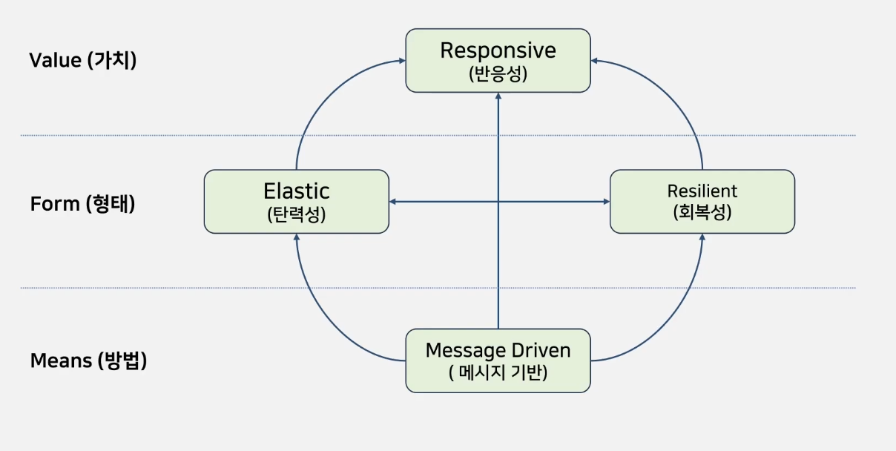
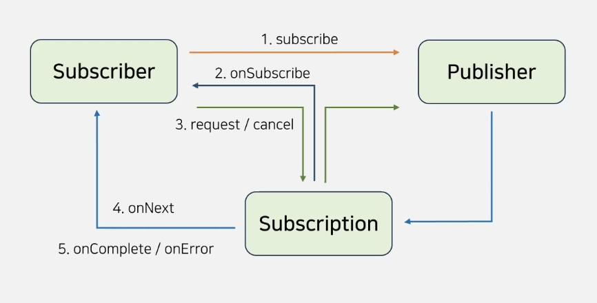
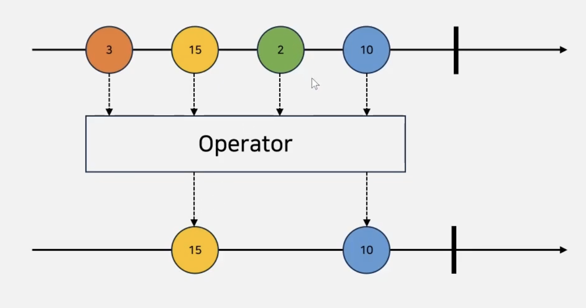

## RestTemplate란?
Spring Framework에서 제공하는 HTTP 통신 도구로, RESTful API 서버와의 상호작용이 가능하다. `동기식 방식`으로 통신하기 때문에 응답을 받을 때까지 블로킹된다. 

### 특징
1. 동기식 요청 & 블로킹 요청
    - Webflux를 통해 비동기식 요청이 가능하다.
2. 자동으로 역직렬화
3. 다양한 형식의 처리 가능
    - JSON, XML, 바이너리 데이터 등이 가능하다.
4. 로깅을 제공
    ```java
    log.info("Request URI : {}", request.getURI());
    log.info("Request Method : {}", request.getMethod());
    log.info("Request Headers : {}", request.getHeaders());
    log.info("Request Body : {}", new String(body, "UTF-8"));
    ```

## 비동기 처리하는 방법
WebClient를 통해 비동기 처리가 가능하다.

| 구분 | RestTemplate | WebClient |
| --- | --- | --- |
| 요청/응답 | 동기 | 비동기 |
| Connection pool | Apache Http Client | Netty |
| 기본 인증 | 지원 | 지원 |
| OAuth2 인증 | 지원 | 지원 |
| JSON 처리 | Jackson, Gson 등 | Jackson, Gson 등 |
| 성능 | 느림 | 빠름 |

# Webflux
> 반응형 및 비동기 웹 애플리케이션 개발 지원 모듈. Reactive Streams 기반으로 비동기적 이벤트 지향 프로그래밍으로 높은 확장성과 성능 제공

## 명령형 프로그래밍 vs 반응형 프로그래밍
| 구분 | 명령형 | 반응형 |
| --- | --- | --- |
| 처리 | 명령어 순서대로  | 데이터 스트림 처리, 데이터 변화에 반응  |
| 동기 | 동기적 | 비동기적 |
| 코드 구성 | 명령형 코드 | 선언형 코드 |
| 사용 예시 | 계산기, 루프 | 이벤트 처리, UI 업데이트 |
| 프로그래밍 종류 | Spring MVC | Webflux |


## Reactor
- 반응현 프로그래밍 구현을 위한 Reactive 라이브러리
- Publisher-Subscriber 패턴으로 동작
- Mono와 Flux의 데이터 스트림 유형 지원

### Publisher-Subscriver 패턴: Reactive Stream
- 비동기 및 이벤트 기반 응용 프로그램을 위한 스트림 처리 기술
- Publisher: 데이터 생성 후, Subscriber로 전송
- Subscriber: Publisher로부터 데이터 받아 소비
- Subscription: Subscriber가 처리할 데이터의 양을 정의

### Pub/Sub과 Prod/Cons의 차이
- 공통점
    - 역할 분리
    - 비동기 처리
    - 버퍼 또는 큐 사용
    - 백프레셔의 존재

- 차이점 (동작 방식)
    - Pub/Sub : 발행된 각 메시지가 모든 Sub에게 보내진다. 따라서 모든 Sub이 받는 메시지는 같다.
    - Prod/Cons : 각 메시지가 하나의 Cons에 의해 소비된다. 작업 부하를 여러 소비자에게 분산하는 메커니즘이다.

### Mono
- Publisher 중 하나로 특정 개수의 데이터항목을 생성하고 이에 대한 결과가 생성.
- 비동기로 결과를 반환하기 때문에 Sub은 결과 생성까지 블로킹되지 않는다.

### Flux
- Publisher 중 하나로 여러 개의 데이터 항목을 생성하고 이에 대한 결과를 생성.

## WebClient
- WebFlux의 일부로 비동기 방식의 HTTP 요청을 보내고 응답 받는 라이브러리

### Spring MVC와 사용할 수 있는가?
Spring Webflux는 Netty 뿐만 아니라 Tomcat 위에서도 동작할 수 있다.


https://velog.io/@ksiisk99/spring2

<br/>

# 스프링 웹플럭스 기초
## 개요
### 리액티브 스트림
- 리액티브 스트림으로 데이터 흐름을 관리하고 Back Pressure를 처리
- 시스템의 리소스를 과부하 없이 효율적으로 관리할 수 있도록 함

```java
Flux<Integer> numberGenerator = Flux.range(1, 100)
    .log()
    .onBackpressureDrop(); // 백프레셔 발생 시 데이터 없애 버림

    numberGenerator
        .publishOn(Shcedulers.boundedElastic())
        .subscribe(
            number -> {
                try {
                    Thread.sleep(50);
                } catch(InterruptedException e) {
                    e.printStackTrace();
                }
                System.out.println("Consumed: " + number);
            },
            error -> System.err.println("Error: " + error),
            () -> System.out.println("Completed")
        );
```

# 리액티브 스트림
리액티브 프로그래밍의 비동기 데이터 스트림과 논 블로킹 백프레셔 표준 API 사양을 제공
- Publisher: 데이터 생성 제공
- Subscriber: 데이터 받아 처리
- Subscription: 전달 받을 데이터 흐름 조절
- Processor: Publisher 및 Subscriber의 기능 모두 포함

구현체: RxJava, Reactor

## Reactive 선언문


## 구조


<br/>

# 마블 다이어그램
## 구조
- 타임라인
- 요소(데이터)
    - 색깔에 따라 방출된다고 계산
    - 동그라미가 아닌 요소들은 가공됨

- 터미널
    
- Input / Operator / Output
    특정 가공 처리 결과 어떻게 되었는지 나타낼 때 사용
    
    예를 들어 3번 요소는 가공 후 사라지고, 15번 요소는 가공 후 그대로고,...

<br/>

# Reactor
Reactive Stream를 구현한 비동기 데이터 스트림 라이브러리
Spring WebFlux에서 지원
Backpressure 등의 기능 지원

## Reactor Publisher 


## Mono
0 .. 1개의 요소를 방출하는 Publisher 구현체 (방출하냐 안하냐)


요소를 방출 or 미방출하고 onComplete 시그널을 보냄

## Flux

0~N개의 요소를 방출하는 Publisher 구현체
onComplete 시그널을 방출하지 않도록 설정하여 무한히 방출하는 퍼블리셔 생성 가능

# Reactor subscribe, buffer, take
## subscribe()
