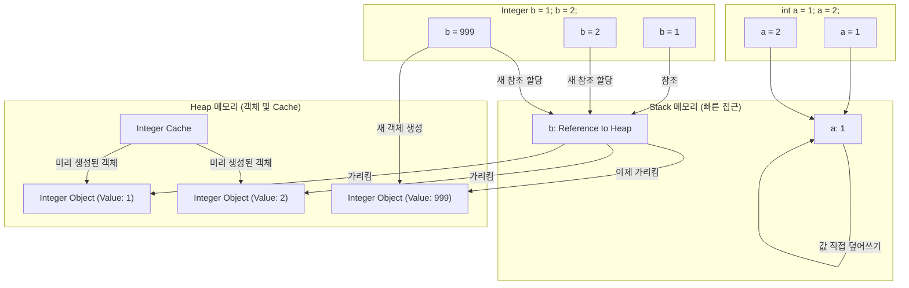

## Autoboxing이란?
- Java 컴파일러가 `Primitive Type`(int, double 등)을 자동으로 해당하는 `Wrapper Class`(Integer, Double 등)로 변환하는 것.
- 반대는 Unboxing이라고 함.

### 주의 사항
- 성능 오버헤드
  - Boxing/Unboxing 과정에서 객체 생성 및 메소드 호출이 발생해 성능 저하 발생
- NPE
  - Wrapper Class가 null일 경우, unboxing하면 NPE 발생
- == 비교 주의
  - Wrapper Class는 객체이므로 `==`로 비교 시 참조 비교가 됨.

### Integer Cache
```java
class Main {
    public static void main(String[] args) {
        Integer a = 127;
        Integer b = 127;

        Integer c = 128;
        Integer d = 128;

        System.out.println(a==b); // true
        System.out.println(c==d); // false
    }
}
```

위 코드에서 `Integer a = 127;`은 `Integer a = Integer.valueof(127);`과 같이 작동한다.

즉, a 와 b는 같은 객체의 참조값을 가지게 된다는 것이다. 왜 그럴까?

그 이유는 IntegerCache에서 low와 high 값 사이의 정수 값에 대해선 캐시를 사용하기 때문이다.

기본값은 -128 ~ 127로 설정되어 있다.

### Integer와 int의 성능 차이
성능 차이가 얼마나 날지 직접 코드를 실행해보았다.
```java
import java.util.*;
import java.lang.*;
import java.io.*;

// The main method must be in a class named "Main".
class Main {
    private static final long ITERATIONS = 100_000_000L; // 10억 번

    public static void main(String[] args) {
        long timeInt = measureIntPerformance();
        System.out.println("int 연산 시간: " + timeInt + " ms");
        System.out.println("------------------------------------");
        long timeInteger = measureIntegerPerformance();
        System.out.println("Integer 연산 시간: " + timeInteger + " ms (오토박싱 오버헤드 포함)");
    }

    public static long measureIntPerformance() {
        long startTime = System.currentTimeMillis();
        int sum = 0;

        for (long i = 0; i < ITERATIONS; i++) {
            sum += 1;
        }
        
        long endTime = System.currentTimeMillis();
        return endTime - startTime;
    }


    public static long measureIntegerPerformance() {
        long startTime = System.currentTimeMillis();
        Integer sum = 0;
        for (long i = 0; i < ITERATIONS; i++) {
            // sum = sum + 1; 코드는 내부적으로 다음과 같은 과정이 반복됩니다.
            // 1. Unboxing: sum (Integer) -> sum.intValue() (int)
            // 2. Addition: sum.intValue() + 1 (int 연산)
            // 3. Boxing: (결과 int) -> new Integer() (새 객체 생성, 캐시 범위 밖인 경우)
            sum += 1;
        }

        long endTime = System.currentTimeMillis();
        return endTime - startTime;
    }
}
```


- ✅ int 연산 시간: 159 ms
- ------------------------------------
-❌ Integer 연산 시간: 1343 ms (오토박싱 오버헤드 포함)

약 10배 정도 차이나는 것을 확인 가능

### 왜 Wrapper Class를 자바만 사용할까?


C의 경우 int에 대한 변수를 직접 정의까지 가능하지만, Java의 경우

1. 객체 지향적 특징 부재
원시 타입은 메모리에 값 자체만을 저장하는 단순한 데이터 형식입니다.

1. 메서드 없음: 원시 타입은 객체가 아니므로, 어떤 메서드도 가질 수 없습니다. 예를 들어, 정수를 이진 문자열로 변환하는 등의 유용한 기능을 원시 타입 자체에서는 제공하지 않습니다. (이러한 기능은 Integer.toBinaryString()처럼 래퍼 클래스의 정적 메서드를 통해 제공됩니다.)

2. 다형성(Polymorphism) 활용 불가: 객체가 아니기 때문에 다형성을 활용할 수 없으며, Object 타입을 요구하는 모든 범용적인 코드에 바로 사용할 수 없습니다.
