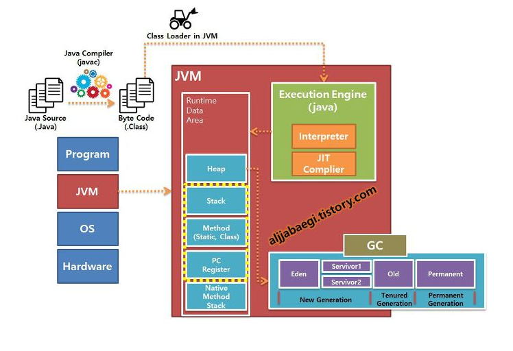

# 컴파일 과정

1. 자바 소스코드(.java) 작성
2. 자바 컴파일러(javac)가 자바 소스코드(.java)를 읽고, 바이트코드(.class)로 컴파일
3. 컴파일된 바이트코드(.class)를 JVM의 Class Loader에게 전달
4. Class Loader는 동적로딩을 통해 필요한 클래스들을 로딩 및 링크해여
    Runtime Data Aread의 `Method Area`에 올림.
5. Execution Engine은 JVM 메모리에 올라온 바이트 코드들을 명령어 다누이로 하나씩 가져와 실행.
    1. 인터프리터: 바이트 코드 명령어를 하나씩 읽어서 해석하고 실행. (전체 실행 속도 느림)
    2. JIT 컴파일러: 바이트 코드 전체를 컴파일하여 바이너리 코드로 변경하여 실행. (전체 속도 빠름)

## 인터프리터와 JIT 컴파일러의 혼합 사용

1. **초기 실행** (Interpreter)
    - 프로그램 실행 초기에는 바이트코드를 인터프리터가 한 줄씩 읽어서 바로 네이티브 코드로 변환하고 실행
    - 하지만 코드를 실행할 때마다 매번 해석(interpret)해야 하므로, 반복적으로 실행되는 코드의 경우 실행 속도가 느릴 수 있습니다.
2. **실행 중 최적화** (JIT Compiler)
    - JVM은 프로그램이 실행되는 동안 `런타임 프로파일러`를 통해 어떤 코드가 **자주 실행되는지(Hotspot)**를 모니터링
    - 특정 메서드나 코드 블록이 미리 설정된 임계값 이상으로 자주 실행되는 Hotspot으로 식별되면,
    - JIT 컴파일러가 해당 바이트코드 부분을 가져와서 최적화된 네이티브 기계어 코드로 변환하고 메모리(코드 캐시)에 저장
