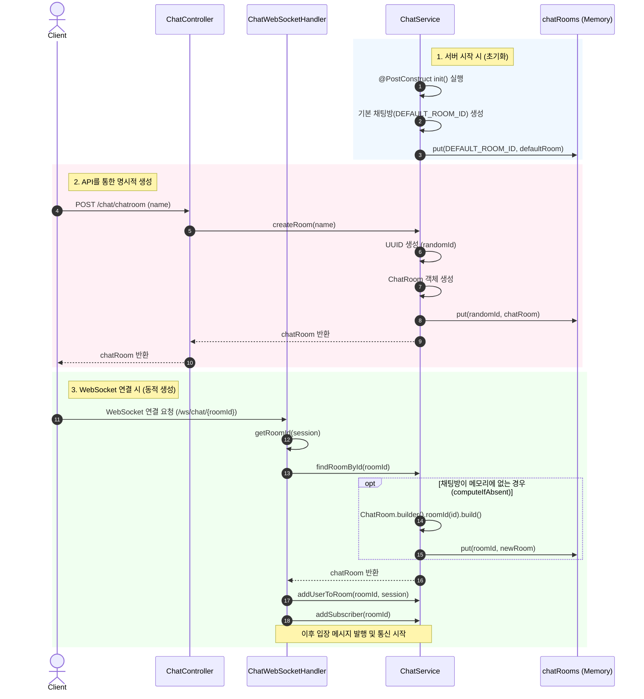

# 개요
## 개념
### WebSocket
- 클라이언트와 서버 사이에 지속적인 양방향 통로(TCP 기반)를 열어두는 것
- 특징
  - 한 번 연결하면 같은 커넥션을 계속 사용
  - 서버가 먼저 push 가능
  - 프레임 단위로 텍스트/ 바이너리 전송
- Spring에서
  - `WebSocketHandler`나 `@ServerEndpoint`로 연결/메시지/종료 이벤트를 직접 처리

### STOMP
- WebSocket 위에서 돌아가는 메시징용 텍스트 프로토콜
- 비유를 들면, WebSocket은 TCP 소켓, STOMP는 HTTP와 같은 규칙
- 특징
  - `SEND`, `SUBSCRIBE`, `CONNECT` 같은 명령어 사용
  - /topic/chat.room1 같은 목적지 설정
  - 헤더 + 바디 구조로 메시지 표현

## 역할 분리
- WebSocket
  - 전송 채널: 연결을 열고, 유지하고, 프레임을 주고받는 저수준 통신
  - 메시지 형식, 라우팅, 방 개념을 직접 설정
- STOMP
  - 메시지 프로토콜
    - 누가 어느 채널에 구독했는지
    - 어떤 채널로 메시지를 보낼지
    - 메시지 헤더/바디 구조
  - 즉, 어떤 규칙으로 채팅방/이벤트를 오갈지를 표준화

## STOMP를 사용하는 이유
WebSocket만 사용할 경우, 세션 Set을 직접 만들어서 직접 관리해야 한다.

### WebSocket

```
roomId -> Set<WebSocketSession>
sessionId -> userId
```
- 접속 시: Set에 넣고
- 나갈 때, Set에서 빼고
- 브로드캐스트: roomId로 세션 찾아서 for-loop로 send

### STOMP
#### 1. Session-Destination 매핑
**[Client]**
```
SUBSCRIBE /topic/room.1
SUBSCRIBE /topic/queue/notice
```
- `세션ID <-> 구독ID <-> 목적지` 로 통신을 하게 된다.

**[Server]**
```java
simpMessagingTemplate.convertAndSend("topic/room.1", payload);
```
- 단순하게 저 메서드로 특정 채널에 있는 세션 전체에게 전송이 가능

#### 2. Session 라이프사이클 이벤트 표준화
```java
@EventListener
public void handleDisconnect(SessionDisconnectEvent event) {
    StompHeaderAccessor accessor = StompHeaderAccessor.wrap(event.getMessage());
    String sessionId = accessor.getSessionId();
}
```
- 브라우저 강제 종료, 네트워크 끊김 등 예기치 못한 종료도 이벤트로 잡아서 정리 가능
- 세션 종료 시 sessionAttributes도 같이 정리되므로, 별도 수명 관리 필요 적음


## Redis Pub/Sub과의 비교
- STOMP는 Websocket 위에서 도는 프로토콜이기 때문에 클라이언트와 애플리케이션 서버 사이에서만 역할
- Redis Pub/Sub은 백엔드 내부에서 돌아가는 메시지 브로커 채널로 서버 간 통신 용도로 사용.

# 적용
## 흐름
