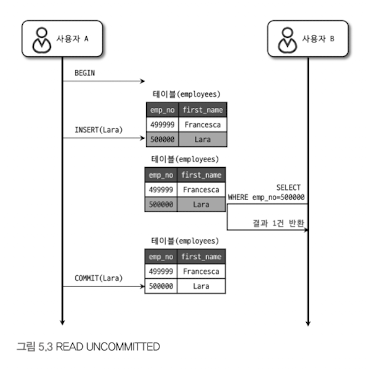
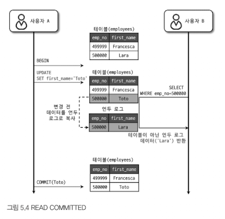
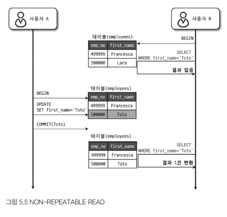

# 5.1 트랜잭션
트랜잭션을 지원하는 InnoDB의 처리 방식 차이를 살펴보고자 한다.
또한, 트랜잭션 사용 시 주의사항도 함께 알아보자.

## 5.1.1 MySQL에서의 트랜잭션
트랜잭션은 쿼리 개수 상관없이 논리적인 작업 셋이 100% 적용되거나 적용되지 않아야함을 보장해주는 단위.
InnoDB는 쿼리 중 일부라도 오류가 발생하면 전체를 원 상태로 만든다는 원칙.

## 5.1.2 주의사항
트랜잭션 또한 DBMS의 커넥션과 동일하게 꼭 필요한 최소의 코드에만 적용하는 것이 좋다.
즉, 프로그램 코드에서 트랜잭션 범위를 최소화하라는 의미다.

예를 들어, 아래 처럼 많은 과정을 트랜잭션으로 처리하게 되면 어떤 문제가 발생할까?
**[잘못된 트랜잭션 설정]**
```
1) 처리 시작
    => 데이터베이스 커넥션 생성
    => 트랜잭션 시작
2) 사용자의 로그인 여부 확인
3) 사용자의 글쓰기 내용의 오류 여부 확인
4) 첨부로 업로드된 파일 확인 및 저장
5) 사용자의 입력 내용을 DBMS에 저장
6) 첨부 파일 정보를 DBMS에 저장
7) 저장된 내용 또는 기타 정보를 DBMS에서 조회
8) 게시물 등록에 대한 알림 메일 발송
9) 알림 메일 발송 이력을 DBMS에 저장
    <= 트랜잭션 종료(COMMIT)
    <= 데이터베이스 커넥션 반납
10) 처리 완료
```
- 데이터베이스 커넥션을 1, 2번 사이에 생성하면, 커넥션 풀이 그만큼 부족 상태로 발생한다.
- 8번 적업은 외부 네트워크 I/O가 발생하기 때문에 트랜잭션에서 빼는 것이 좋다. 만약 네트워크 접속이 안되면, DB에도 영향을 미친다.
- DBMS 작업이 크게 4개가 있다. 5,6 번은 하나의 트랜잭션으로 묶어야 하며, 7번 작업은 저장된 데이터 단순 확인 및 조회이므로 트랜잭션에 포함할 필요 없음.

**[수정된 트랜잭션]**
```
1) 처리 시작
2) 사용자의 로그인 여부 확인
3) 사용자의 글쓰기 내용의 오류 여부 확인
4) 첨부로 업로드된 파일 확인 및 저장
    => 데이터베이스 커넥션 생성
    => 트랜잭션 시작
5) 사용자의 입력 내용을 DBMS에 저장
6) 첨부 파일 정보를 DBMS에 저장
    <= 트랜잭션 종료(COMMIT)
7) 저장된 내용 또는 기타 정보를 DBMS에서 조회
8) 게시물 등록에 대한 알림 메일 발송
    => 트랜잭션 시작
9) 알림 메일 발송 이력을 DBMS에 저장
    <= 트랜잭션 종료(COMMIT)
    <= 데이터베이스 커넥션 반납
10) 처리 완료
```

# 5.2 MySQL 엔진의 잠금
MySQL에서 사용되는 잠금은 크게 스토리지 엔진 레벨과 MySQL 엔진 레벨로 나눌 수 있다.
- MySQL 엔진 레벨 잠금
    - 모든 스토리지 엔진에 영향 미침
    - 메타데이터 락, 네임드 락 제공
- 스토리지 엔진 레벨의 잠금
    - 스토리지 엔진 간 상호 영향을 미치지 않음
  

## 5.2.1 글로벌 락
- `FLUSH TABLES WITH READ LOCK`으로 획등이 가능.
- 잠금 가운데 가장 범위가 큼.
- 한 세션에서 글로벌 락을 획득하면 다른 세션에서 SELECT 제외한 대부분 쿼리가 대기 상태로 남음.
- MySQL 서버의 모든 변경 작업을 멈춤.
	- InnoDB 스토리지 엔진은 트랜잭션을 지원하기 때문에 일관된 데이터 상태를 위해

## 5.2.2 테이블 락
- 개별 테이블 단위로 설정
- 명시적 락: `LOCK TABLES table_name [READ | WRITE]`로 잠금
	- UNLOCK TABLES로 잠금 반납 가능
	- 특별한 상황 아니면 애플리케이션에서 사용안함
	- 왜냐하면 테이블 잠그는 작업이 온라인 작업에 상당한 영향을 미침
- 묵시적 테이블 락은 쿼리가 실행되는 동안 자동으로 획득됐다가 쿼리가 완료된 후 자동 해제
	- InnoDB 테이블의 경우 스토리지 엔진 차원에서 레코드 기반 잠금을 제공하기에 단순 데이터 변경 쿼리로 설정되지 않음

## 5.2.3 네임드 락
- `GET_LOCK()` 함수로 임의의 문자열 잠금 설정
- 대상이 테이블이나 레코드 또는 AUTO_INCREMENT 같은 데이터베이스 객체가 아니라 사용자 지정 문자열
```sql
SELECT GET_LOCK('mylock', 2);

SELECT IS_FREE_LOCK('mylock');

SELECT RELEASE_LOCK('mylock');
```
- 많은 레코드에 대해 복잡한 요건으로 레코드 변경하는 트랜잭션에 유용

## 5.2.4 메타데이터 락
- 데이터베이스 객체의 이름이나 구조를 변경하는 경우에 획득하는 잠금
- `RENAME TABLE tab_a TO tab_b`같은 경우 자동으로 획득

# 5.3 InnoDB 스토리지 엔진 잠금
- InnoDB는 레코드 기반의 잠금 방식으로 MyISAM보다 훨씬 뛰어난 동시성 처리를 제공
- `information_schema` 데이터베이스에 존재하는 `INNODB_TRX`, `INNODB_LOCKS`, `INNODB_LOCK_WAITS`라는 테이블을 조인해서 어떤 트랜잭션이 어떤 자금을 대기하고 있는지 확인 가능

## 5.3.1 InnoDB 스토리지 엔진의 잠금
- 작은 공간으로 잠금 정보를 관리하기에 레코드 락이 페이지 락으로, 테이블 락으로 레벨업되지 않음
- 레코드와 레코드 사이의 간격을 잠그는 갭 락이 존재
![[Pasted image 20251203215808.png]]

### 5.3.1.1 레코드 락
- InnoDB 스토리지 엔진은 레코드 자체가 아니라 인덱스의 레코드를 잠금
	- 클러스터 인덱스를 이용해 잠금
- 대부분 보조 인덱스를 이용한 변경 작업은 넥스트 키 락 또는 갭락 사용

### 5.3.1.2 갭 락
- 레코드와 바로 인접한 레코드 사이의 간격만을 잠금
- 레코드와 레코드 사이에 새로운 레코드가 INSERT되는 것을 제어하기 위해 사용

### 5.3.1.3 넥스트 키 락
- 레코드 락 + 갭 락
- STATEMENT 포맷의 바이너리 로그를 사용하는 MySQL 서버에서 REPEATABLE READ 격리 수준 사용
- 갭 락과 넥스트 키 락은 바이너리 로그에 기록되는 쿼리가 레플리카 서버에서 실행될 때 소스 서버에서 만들어 낸 결과와 동일한 결과를 만들어내도록 보장함.
	- 근데 갭 락과 넥스트 키 락으로 데드락이 발생하거나 다른 트랜잭션을 기다리게 만드는 일이 자주 발생
	- 가능하면 바이너리 로그 포맷을 ROW 형태로 바꿔서 넥스트 키 락이나 갭 락을 줄이는게 좋음

### 5.3.1.4 자동 증가 락
- AUTO_INCREMENT 락으로 테이블 수준의 잠금을 사용
- 새로운 레코드 저장하는 쿼리에서만 필요
- AUTO_INCREMENT 값을 가져올 때 사용.
- 하나만 가지고 있어, 무조건 대기해야 함
- 간소화를 위해 한 번 증가하면 절대 줄어들지 않음

## 5.3.2 인덱스와 잠금
- 변경해야 할 레코드를 찾기 위해 검색한 인덱스의 레코드를 모두 락을 걸어야 함
```sql
-- // ix_firstname이라는 인덱스만 가짐
SELECT COUNT(*) FROM employees WHERE first_name='Georgi';
-- // 결과: 253

SELECT COUNT(*) FROM employees WHERE first_name='Georgi' AND last_name='Klassen';
-- // 결과: 1

UPDATE employees SET hire_date=NOW() WHERE first_name='Georgi' AND last_name='Klassen';
```
- 위 쿼리에서 UPDATE로 1건의 레코드를 업데이트 하기 위해 253건의 레코드가 모두 잠긴다.
- UPDATE를 위해 적절히 인덱스가 없으면 클라이언트 간 동시성이 상당히 떨어져서 그 테이블을 업데이트하지 못하고 기다려야 하는 상황이 발생
![[Pasted image 20251203221007.png]]

## 5.3.3 레코드 수준의 잠금 확인 및 해제
- 테이블 잠금에선 잠금 대상이 테이블 자체이므로 문제의 원인 파악이 쉬움
  - 레코드 수준의 테이블의 레코드 각각에 잠금이 걸리므로 그 레코드가 자주 사용되지 않으면 오랫동안 잠긴 상태로 남아있어도 발견되지 않음

실제 트랜잭션을 바탕으로 정보를 한번 추출해보자.

| 커넥션 1 | 커넥션 2 | 커넥션 3 |
|:-------|:-------|:--------|
| `BEGIN;` |  |  |
| `UPDATE employees SET birth_date=NOW() WHERE emp_no=100001;` |  |  |
|  | `UPDATE employees SET birth_date=NOW() WHERE emp_no=100001;` |  |
|  |  | `UPDATE employees SET hire_date=NOW(), birth_date=NOW() WHERE emp_no=100001;` |

```
+----+--------+----------+-----------------------------------------------------------+
| Id | Time   | State    | Info                                                      |
+----+--------+----------+-----------------------------------------------------------+
| 17 |    607 |          | NULL                                                      |
| 18 |     22 | updating | UPDATE employees SET birth_date=NOW() WHERE emp_no=100001 |
| 19 |     21 | updating | UPDATE employees SET birth_date=NOW() WHERE emp_no=100001 |
+----+--------+----------+-----------------------------------------------------------+
```

- 17번 스레드는 아무것도 하지 않고 있음.
- 17번 스레드가 커밋되지 않아, 18번과 19번 스레드가 UPDATE를 웨이팅하고 있다.

실제로 performance_schema의 data_locks와 data_lock_waits 테이블을 조인하여 잠금 대기 순서를 살펴보자.

```sql
SELECT
    r.trx_id waiting_trx_id,
    r.trx_mysql_thread_id waiting_thread,
    r.trx_query waiting_query,
    b.trx_id blocking_trx_id,
    b.trx_mysql_thread_id blocking_thread,
    b.trx_query blocking_query
    FROM performance_schema.data_lock_waits w
    INNER JOIN information_schema.innodb_trx b
        ON b.trx_id = w.blocking_engine_transaction_id
    INNER JOIN information_schema.innodb_trx r
        ON r.trx_id = w.requesting_engine_transaction_id;
```
```
+---------+---------+-------------------+----------+----------+-------------------+
| waiting | waiting | waiting_query     | blocking | blocking | blocking_query    |
| _trx_id | _thread |                   |  _trx_id |  _thread |                   |+---------+---------+-------------------+----------+----------+-------------------+
|   11990 |      19 | UPDATE employees..|    11989 |       18 | UPDATE employees..|
|   11990 |      19 | UPDATE employees..|    11984 |       17 | NULL              |
|   11989 |      18 | UPDATE employees..|    11984 |       17 | NULL              |+---------+---------+-------------------+----------+----------+-------------------+
```

더 상세한 정보 조회를 위해 performance_schema의 data_locks 테이블이 가진 칼럼을 모두 살펴보자.

```sql
SELECT * FROM performance_schema.data_locks\G

*************************** 1. row ***************************
ENGINE: INNODB
ENGINE_LOCK_ID: 4828335432:1157:140695376728800
ENGINE_TRANSACTION_ID: 11984
THREAD_ID: 61
EVENT_ID: 16028
OBJECT_SCHEMA: employees
OBJECT_NAME: employees
PARTITION_NAME: NULL
SUBPARTITION_NAME: NULL
INDEX_NAME: NULLOBJECT_INSTANCE_BEGIN: 140695376728800
LOCK_TYPE: TABLE
LOCK_MODE: IX
LOCK_STATUS: GRANTED
LOCK_DATA: NULL
*************************** 2. row ***************************
ENGINE: INNODB
ENGINE_LOCK_ID: 4828335432:8:298:25:140695394434080
ENGINE_TRANSACTION_ID: 11984
THREAD_ID: 61
EVENT_ID: 16048
OBJECT_SCHEMA: employees
OBJECT_NAME: employees
PARTITION_NAME: NULL
SUBPARTITION_NAME: NULL
INDEX_NAME: PRIMARYOBJECT_INSTANCE_BEGIN: 140695394434080
LOCK_TYPE: RECORD
LOCK_MODE: X,REC_NOT_GAP
LOCK_STATUS: GRANTED
LOCK_DATA: 100001
```

- employees 테이블에 대해 IX 잠금(Intentional Exclusive)를 가짐
- employees 테이블의 특정 레코드에 대해 쓰기 잠금을 가지고 있음
  - REC_NOT_GAP 표시가 있으므로 레코드 잠금은 갭이 포함되지 않은 순수 레코드에 대해서만 잠금 가짐

<br/>

# 5.4 MySQL의 격리 수준
|  | DIRTY READ | NON-REPEATABLE READ | PHANTOM READ |
|:----|:-----|:------|:-----|
| READ UNCOMMITTED | O | O | O           |
| READ COMMITTED   | X | O | O           |
| REPEATABLE READ  | X | X | O(InnoDB X) |
| SERIALIZABLE     | X | X | X           |

## 5.4.1 READ UNCOMITTED


## 5.4.2 READ COMMITED



- 다른 트랜잭션에서 커밋된 내용이 반영되기 때문에 NON-REPEATABLE READ가 발생한다.

## 5.4.3 REPEATABLE READ
- 바이너리 로그를 가진 MySQL 서버에서 최소 REPEATABLE READ 격리 수준 이상을 사용해야 한다.
- ROLLBACK 될 가능성에 대비해 변경되기 전 레코드를 언두 공간에 백업해두고 실제 레코드 값을 변경.
  - 이런 방식을 MVCC(Multi Version Concurrency Control)이라고 한다.
- MVCC를 보장하기 위해 실행 중인 트랜잭션 중 가장 오래된 트랜잭션 번호보다 트랜잭션 버호가 앞선 언두 영역의 데이터는 삭제할 수 없다.


- 사용자 B가 TX 10을 부여 받으면, TX 10 안에서 실행되는 모든 SELECT 쿼리는 트랜잭션 번호가 10보다 작은 TX 번호에서 변경한 것만 보게 됨.
- 당영하게도 언두에 백업된 레코드가 많아지면 처리 성능이 떨어짐


- B가 트랜잭션 시작 후 SELECT를 두 번하면 멱등성이 보장되어야 하는데, `FOR UPDATE`에 따라 결과가 달라지는 팬텀 리드가 발생한다.
  - `FOR UPDATe`나 `LOCK IN SHARE MODE`로 조회되는 레코드는 현재 레코드 값을 가져오기 때문이다.

## 5.4.4 SERIALIZABLE
- InnoDB 스토리지 엔진에선 갭 락과 넥스트 키 락 덕분에 REPEATABLE READ 격리 수준에서 이미 팬텀리드가 발생하지 않기 때문에 굳이 사용할 필요가 없음.
