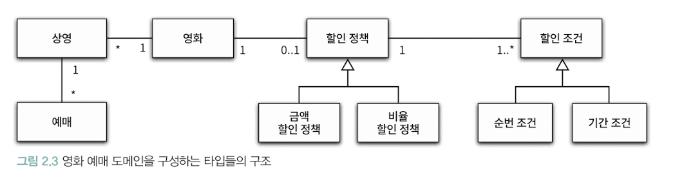
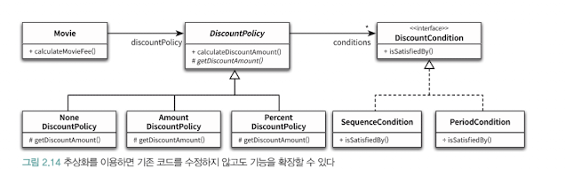
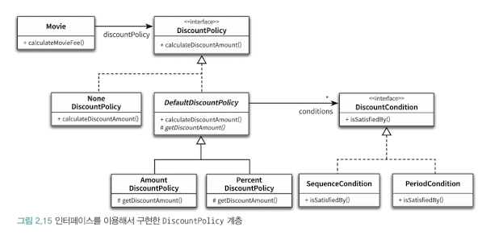

# 영화 예매 시스템

### 할인 정책과 할인 조건
할인 정책은 AmountDiscountPolicy와 PercentDiscountPolicy 가 존재한다.
이를 DiscountPolicy라는 추상 클래스로 묶어서 구현하자.

이처럼 부모 클래스에서 기본적인 알고리즘 흐름을 구현하고 중간에 필요한 처리를 자식 클래스에 위임하는 디자인 패턴은 `Template Method 패턴`이라고 한다.

## 상속과 다형성
### 컴파일 시간 의존성과 실행 시간 의존성

위 클래스 설계서 처럼 Movie는 컴파일 단에선 DiscountPolicy를 의존하지만, 실행이 되면 상속받은 AmountDiscountPolicy나 PercentDiscountPolicy를 의존하도록 바뀐다.

즉, 확장 가능한 객체지향 설계에선 코드의 의존성과 실행 시점의 의존성이 다르다.

### 상속과 인터페이스
자식 클래스는 상속을 통해 부모 클래스의 인터페이스를 물려받기에 부모 클래스 대신 사용 가능.
이처럼 자식 클래스가 부모 클래스를 대신하는 것을 upcasting이라고 부른다.

### 다형성
동일한 메시지를 수신했을 때 객체 타입에 따라 다르게 응답할 수 있는 능력을 말한다.
다시 말해 메시지와 메서드를 실행 시점에 바인딩하는 것을 Lazy Binding (또는 동적 바인딩).
컴파일 시점에 결정하는것을 을 Early Binding (또는 정적 바인딩)이라고 부름.

## 추상화와 유연성
만약 DiscountPolicy에서 아예 할인 정책이 없는 경우에 단순하게 DiscountPolicy를 상속받는 NoneDiscountPolicy를 만들어서 사용하면 된다.
이처럼 추상화하여 컨텍스트 독립성을 보장한다.

### 추상 클래스와 인터페이스 트레이드 오프
NoneDiscountPolicy는 getDiscountAmount()가 어떤 값을 반환하더라도 상관이 없다.
추상 클래스에서 사용하지 않는 필드를 굳이 가지고 잇을 필요하거 없기 때문에, 인터페이스를 통해 역할만 설정받도록 하면 된다.

## 상속과 합성
### 상속
- 부모 클래스의 필드와 메서드를 자식이 물려받는 방식
- is-a 관계
- 특징.
  - 화이트박스 재사용
  - 정적 관계
- 장점
  - 코드 간결 및 재사용
  - 다형성
- 단점
  - 강한 결합도
  - 불필요 기능까지 상속

### 합성
- 클래스 내부에 다른 클래스의 인스턴스를 필드로 포함하여 사용
- has-a 관계
- 특징
  - 블랙박스 재사용
  - 동적 관계
- 장점
  - 느슨한 결합
  - 필요한 기능만 가져올 수 있음
- 단점
  - 객체 간 관계 파악 어려움
  - 단순 상속보다 코드가 길어짐
