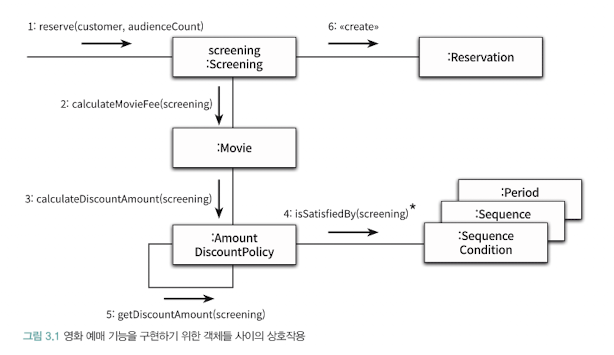

# 역할, 책임, 협력
## 협력


협력이란 어떤 객체가 다른 객체에게 무엇인가를 요청하는 것.
즉, 두 객체가 상호작용해서 더 큰 책임을 수행하는 것.

그런데 이 경우 자율성이 훼손되기도 한다.
> 자율적인 객체: 자신으 ㅣ상태를 직접 관리하고 스스로 결정에 따라 행동하는 객체

이를 해결하기 위해 내부 구현을 캡슐화한다.

### 협력이 설계를 위한 문맥을 결정한다.
객체의 행동을 결정하는 것은 객체가 참여하고 있는 협력이다.
협력이 바뀌면 객체가 제공해야 하는 행동 역시 바뀐다.

예를 들어, 영화 예매 시스템에서 Movie 클래스는 영화 예매를 위해 협력으로서 객체 행동이 결정된다.
기본 요금인 fee와 할인 정책인 discountPolicy라는 인스턴스 변수를 상태의 일부로 포함하는 것도 이 때문이다.

## 책임
- 하는 것
  - 객체를 생성하거나 계산을 수행하는 등의 스스로 하는 것
  - 다른 객체의 행동을 시작시키는 것
  - 다른 객체의 활동을 제어하고 조절하는 것
- 아는 것
  - 사적인 정보에 관해 아는 것
  - 관련된 객체에 관해 아는 것
  - 자신이 유도하거나 계산할 수 있는 것에 관해 아는 것

객체지향 설계에서 가장 중요한 것은 책임이다.

### 책임 할당
자율적인 객체를 만드는 가장 기본적인 방법은 필요한 정보를 가장 잘 알고 있는 전문가에게 그 책임을 할당하는 것.
이를 정보 전문가 패턴이라고 부른다.

예를 들어, `예매하라`라는 책임을 수행하기 위해서 가장 많은 정보를 가진 Screening에게 위임할 수 있다. 하지만, Screening에는 요금 관련 내용이 없기 때문에 `가격을 계산하라`라는 책임을 Movie에게 위임하도록 한다.

### 책임 주도 설계
- 시스템이 사용자에게 제공해야 하는 기능인 시스템 책임을 파악한다.
- 시스템 책임을 더 작은 책임으로 분할한다.
- 분할된 책임을 수행할 수 있는 적절한 객체 또는 역할을 찾아 책임을 할당한다.
- 객체가 책임을 수행하는 도중 다른 객체의 도움이 필요한 경우 이를 책임질 적절한 객체 또는 역할을 찾는다.
- 해당 객체 또는 역할에게 책임을 할당함으로써 두 객체가 협력하게 한다.

### 메시지가 객체를 결정한다
```java
// AS-IS
if (shapeType == CIRCLE) drawCircle();
else if (shapeType == RECTANGLE) drawRectangle();

// TO-BE
shape.draw();
```

- 이유
  - 최소한의 인터페이스를 가질 수 있다.
  - 추상적인 인터페이스를 가질 수 있게 된다.

### 행동이 상태를 결정한다
객체가 협력에 적합한지 결정하는 것은 그 객체의 상태가 아니라 행동이다.
객체의 행동이 아니라 상태에 초점을 맞출 경우, 객체 내부 구현이 객체의 퍼블릭 인터페이스에 노출되도록 하기에 캡슐화를 저해한다.

```java
// AS-IS
// 상태(데이터) 중심의 객체
class Account {
    public long balance; // 상태가 외부에 노출됨 (getter/setter 포함)
}

// 외부에서 로직을 처리 (데이터에 의존)
class BankService {
    public void withdraw(Account account, long amount) {
        if (account.balance >= amount) { // 외부에서 상태를 직접 확인
            account.balance -= amount;   // 외부에서 상태를 직접 변경
        } else {
            System.out.println("잔액 부족");
        }
    }
}
```
- Account는 스스로 하는 일이 없고, 외부에서 그 상태를 조정하기 때문에 내부 구현이 외부에 노출되어, 캡슐화의 본질인 정보 은닉이 실패하게 됨.

```java
// TO-BE
// 행동(책임) 중심의 객체
class Account {
    private long balance; // 내부 상태는 철저히 숨김 (캡슐화)

    // "출금하라"는 메시지에 응답할 책임(행동)을 가짐
    public void withdraw(long amount) {
        if (this.isWithdrawalPossible(amount)) {
            this.balance -= amount;
            System.out.println(amount + "원 출금 완료");
        } else {
            throw new IllegalArgumentException("잔액이 부족합니다.");
        }
    }

    private boolean isWithdrawalPossible(long amount) {
        return this.balance >= amount;
    }
}

// 외부에서는 메시지만 던짐
class BankService {
    public void processWithdraw(Account account, long amount) {
        account.withdraw(amount); // "출금해줘"라고 메시지만 보냄 (What)
    }
}
```

## 역할
만약 두 개의 할인 정책인 AmountDiscountPolicy와 PercentDiscountPolicy를 각각 사용할 경우, 중복 코드가 발생한다. 따라서 이를 하나의 역할로 묶어서 중복코드를 방지한다.

> 역할: 여러 책임이 집합된 슬롯 혹은 자리.

### 객체 대 역할
오직 한 종류의 객체만 협력에 참여하는 상황에서 역할이라는 개념을 고려하느 ㄴ것이 유요한가?
협력에 적합한 책임을 수행하는 대상이 한 종류라면 간단하게 객체로 간주한다.