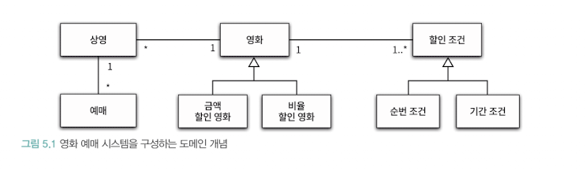
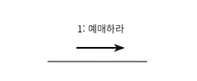
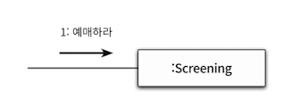
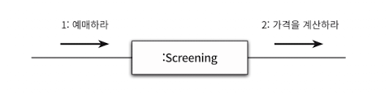
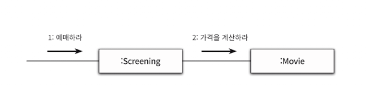
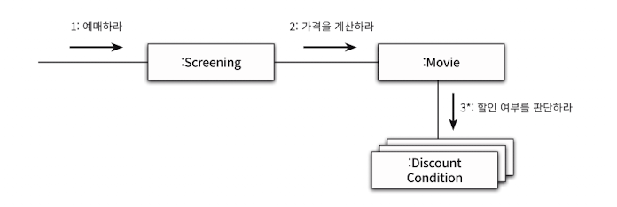
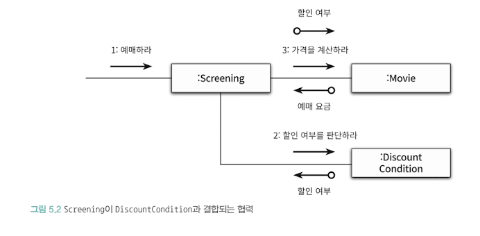

# 1. 책임 주도 설계를 향해
### 데이터보다 행동을 먼저 결정하라
너무 이른 시기에 데이터에 초점 맞추면, 캡슐화가 약화 -> 낮은 응집도와 높은 결합도 -> 변경에 취약

### 협력이라는 문맥 안에서 책임을 결정하라
- 객체에게 할당된 책임의 품질은 협력에 적합한 정도로 결정
- 책임은 객체의 입장이 아니라 객체가 참여하는 협력에 적합해야 한다. -> 객체의 책임을 어떻게 식별해야 하는가에 대한 힌트를 제공
- 메시지가 클라이언트의 의도를 표현한다는 사실에 주목
  - 객체를 결정하기 전에 객체가 수신할 메시지를 먼저 결정하는 점

# 2. 책임 할당을 위한 GRASP 패턴
어떤 책임을 할당해야 할 때 가장 먼저 고민해야 하는 유력한 후보는 도메인 개념


### 정보 전문가에게 책임을 할당
- 사용자에게 제공해야 하는 기능은 영화를 예매하는 것


> 메시지를 수신할 적합한 객체는 누구인가?

- INFORMATION EXPERT 패턴은 객체가 자신이 소유한 정보와 관련된 작업을 수행하는 것을 표현
  - 정보는 데이터와 다름
- 상영은 영화 정보, 상영 시간, 상영 순번처럼 영화 예매에 필요한 정보를 가지고 있기에 영화 예매 전문가이다.



그러나 예매 과정에서 필요한 가격 계산 작업은 Screening으로 불가능하다. 영화 한 편의 가격을 Movie가 가지고 있기 때문이다.





- 영화가 할인 가능한지 판단 후 할인 정책에 따라 할인 요금을 제외한 금액을 계산
- 따라서, Movie는 할인 여부를 판단하라 메시지를 전송해서 외부의 도움을 요청


할인 정보는 DiscountCondition이 가지므로 DiscountCondition에게 메시지를 전송

### 낮은 결합도

- 설계는 트레이드오프 활동
- 왜 Movie가 DiscountCondition과 협력하는 방법을 사용할까?

- Movie와 DiscountCondition은 이미 결합돼 있기 때문에 Movie를 DiscountCondition과 협력하도록 하면 결합도를 추가하지 않아도 된다.
```java
public class Movie {
    private String title;
    private Duration runningTime;
    private Money fee;
    private List<DiscountCondition> discountConditions;

    private MovieType movieType;
    private Money discountAmoint;
    private double discountPercent;
}
```

### 높은 응집도
- Screening의 책임은 예매를 생성하는 것
- 만약 Screening이 DiscountCondition과 협력하면, 영화 요금 계산이라는 책임도 떠안게 됨.
- 이는 Screening이 할인 여부 판단, Movie에서 필요한 정보를 알게됨.
Screening과 DiscountCondition이 협력하게 되면 Screening은 서로 다른 이유로 변경되는 책임을 젊어지게 되므로 응집도가 낮아짐

### 창조자에게 객체 생성 책임을 할당
- 영화 예매 협력의 최종 결과물은 Reservation 인스턴스를 생성하는 것
- Screening은 예매를 수행하기 때문에 Reservation의 창조자로 적합하다.

# 3. 구현을 통한 검증
```java
public class Screening {
  private Movie movie;
  private int sequence;
  private LocalDateTime whenScreened;

  public Reservation reserve(Customer customer, int audienceCount) {
    return new Reservation(customer, this, calculateFee(audienceCount), audienceCount);
  }

  private Money calculateFee(int audienceCount) {
    return movie.calculateMovieFee(this).times(audienceCount);
  }
}
```

```java
public class Movie {
  private String title;
  private Duration runningTime;
  private Money fee;
  private List<DiscountCondition> discountConditions;

  public Money calulateMovieFee(Screening screening) {
    if (isDiscountable(screening)) {
      return fee.minus(calculateDiscountAmount());
    }

    return fee;
  }

  public boolean isDiscountable(Screening screening) {
    return discountConditions.stream()
            .anyMatch(condition -> condition.isSatisfiedBy(screening));
  }

  public Money calculateDiscountAmount() {
    switch(movieType) {
      case AMOUNT_DISCOUNT:
        return calculateAmountDiscountAmount();
      case PERCENT_DISCOUNT:
        return calculatePercentDiscountAmount();
      case NONE_DISCOUNT:
        return calculateNoneDiscountAmount();
    }
  }

  private Money calculateAmountDiscountAmount() {    return discountAmount;  }
  private Money calculatePercentDiscountAmount() {    return fee.time(discountPercent);  }  private Money calculateNoneDiscountAmount() {    return Money.ZERO;  }
}

public enum MovieType {
  AMOUNT_DISCOUNT,
  PERCENT_DISCOUNT,
  NONE_DISCOUNT
}
```

```java
public class DiscountCondition {
  private DiscountConditionType type;
  private int sequence;
  private DayOfWeek dayOfWeek;
  private LocalTime startTime;
  private LocalTime endTime;

  public boolean isSatisfiedBy(Screening screening) {
    if (type == DiscountConditionType.PERIOD) {
      return isSatisfiedByPeriod(screening);
    }

    return isSatisfiedBySequence(screening);
  }

  private boolean isSatisfiedByPeriod(Screening screening) {
    return dayOfWeek.equals(screening.getWhenScreened().getDayOfWeek()) &&
    startTime.compareTo(screening.getWhenScreened().toLocalTime()) <= 0 &&
    endTime.isAfter(screening.getWhenScreened().toLocalTime()) >= 0;
  }

  private boolean isSatisfiedBySequence(Screening screening) {
    return sequence == screening.getSequence();
  }
}
```

## DiscountCondition 개선하기
1. 새로운 할인 조건 추가 시, isSatisfiedBy의 if 문 수정 필요
2. 순번 조건을 판단하는 로직 변경
  - isSatisfiedBySequence 메서드의 내부 구현을 수정해야 함
3. 기간 조건을 판단하는 로직이 변경되는 경우
  - isSatisfiedByPeriod 메서드의 내부 구현을 수정해야 함

- 코드를 통해 변경의 이유를 파악하는 첫번째 방법
  - 인스턴스 변수가 초기화 되는 시점: 응집도가 높으면 모든 속성을 함께 초기화 해야함
  - DiscountCondition이 순번 조건을 표현하는 경우 sequence는 초기화되지만, dayOfWeek, startTime, endTime은 초기화되지 않음
  - 함께 초기화되는 속성을 기준으로 코드를 분리 하면됨
- 코드를 통해 변경의 이유를 파악하는 두번째 방법
  - 메서드들이 인스턴스 변수를 사용하는 방식
  - 모든 메서드가 객체의 모든 속성을 사용하면 응집도가 높은 것임
  - isSatisfiedBySequence 메서드와 isSatisfiedByPeriod 메서드가 각각의 필드를 사용하므로 분리해야 함

## 타입 분리하기
